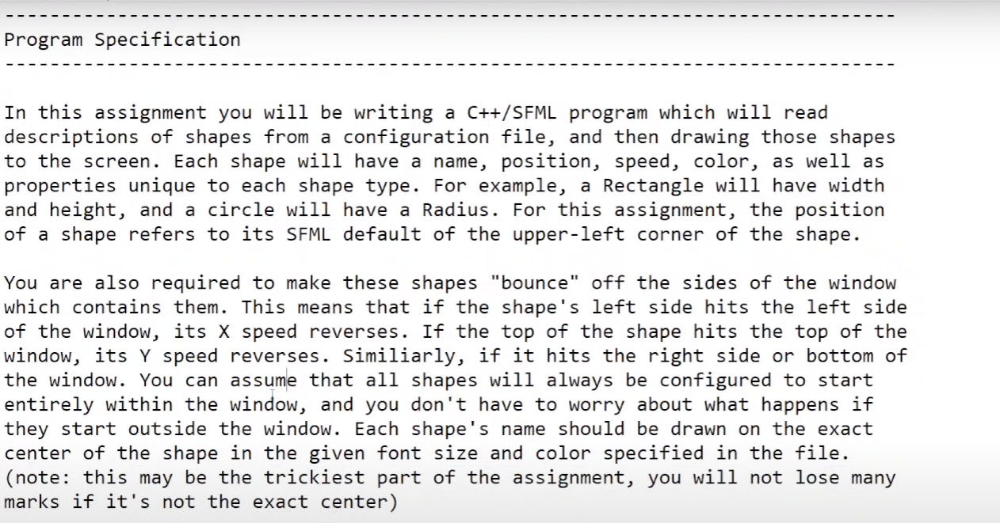
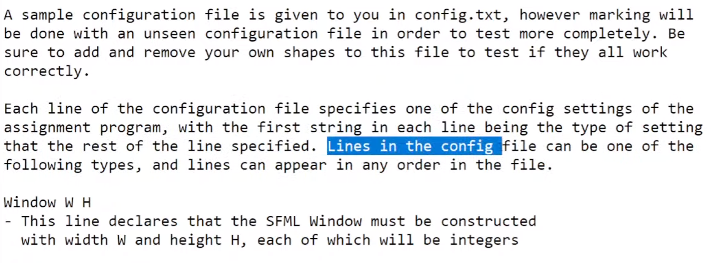
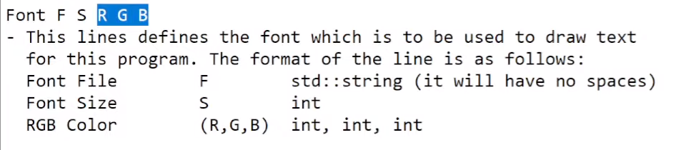
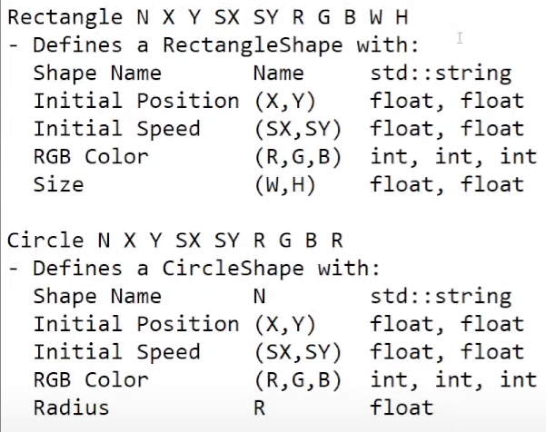
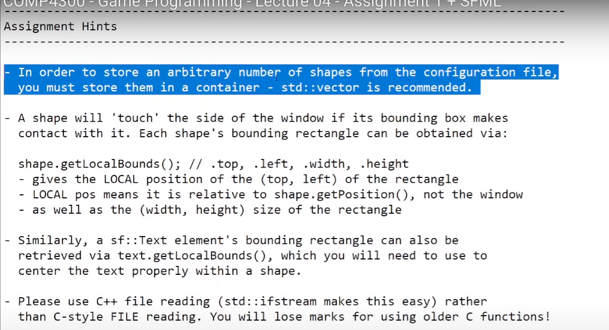
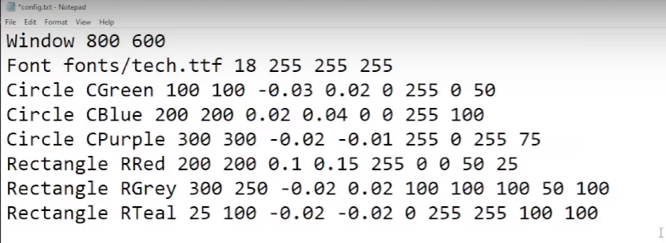

## project 1: 

### Config file(make sure program works even when adding and removing new shapes config):

### Compile command:
`g++ ./*.cpp -std=c++17 -o=game -lsfml-graphics -lsfml-window -lsfml-system -lsfml-audio`
